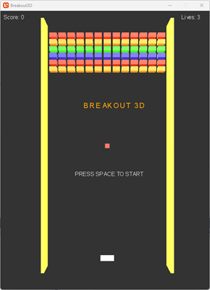
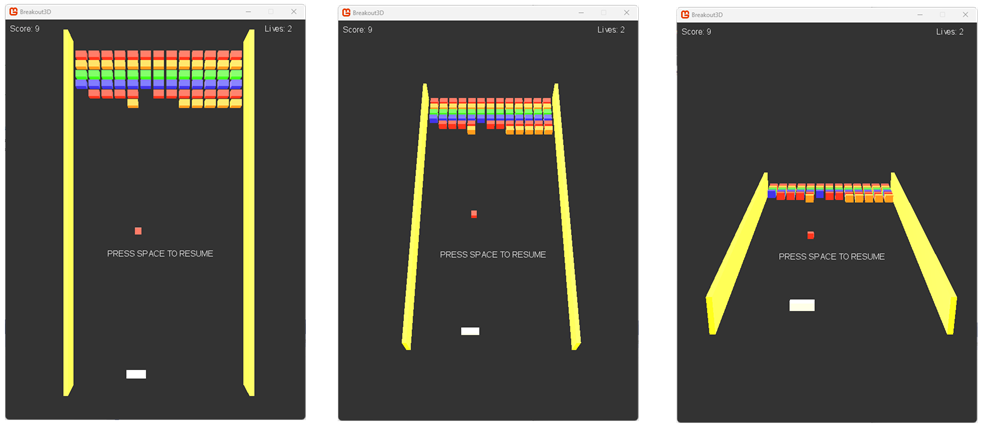
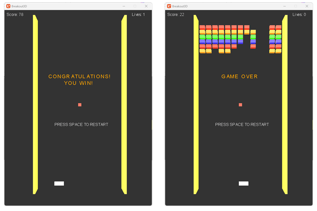

# Breakout3D
Breakout is one of the first arcade video games. It was designed by Steve Wozniak, developed and published by Atari in 1976.

The main concept of the game is the 'escape from prison'. The gameplay rules are very simple: the player controls a pallet. By bouncing the ball, the player must achieve the destruction of the bricks at the top of the screen.

This project is a refreshed version of the classic game. The main principles of the game stay the same as in the original, including that the gameplay itself will remain two-dimensional. However, the game has been made in full 3D.

This game has been developed using the C# language and the MongoGame framework.

## Builds
If you want you can download current versions of build here: https://drive.google.com/drive/folders/1iDL7oaoRE-F5e2dz7nSlowHoKs0-4KH0?usp=drive_link

## Screenshots
All screenshots from current version are available here: https://drive.google.com/drive/folders/1ky2D3YYog6gdsnBx7DJIEEL6v5oDQWQo?usp=drive_link

### 1. Start game

### 2. Various camera angles

### 2. Win and Lose
